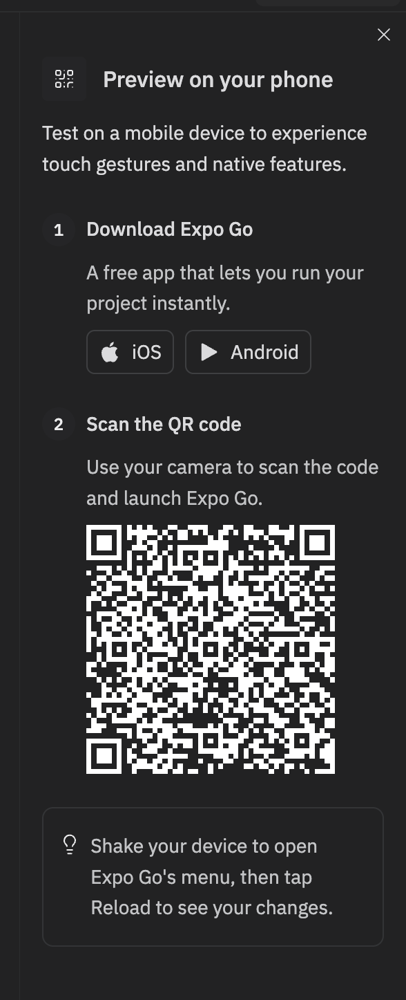

# Co-Star for Founders

**An AI coach-council for founders.** Building is lonely. Co-Star gives you a room
full of advisors with sharp, distinct points of view — talk to one, summon the
whole council to debate your problem, or let it auto-pick the right voice for what
you're carrying.

> Coaching and company — not a substitute for professionals.

---

## Run it on your phone in ~2 minutes

The app is built with **Expo** (React Native). The fastest way to try it on a real
device is with the **Expo Go** app and the QR code from the running dev server.

### 1. Install Expo Go on your phone

- **iOS:** [Expo Go on the App Store](https://apps.apple.com/app/expo-go/id982107779)
- **Android:** [Expo Go on Google Play](https://play.google.com/store/apps/details?id=host.exp.exponent)

### 2. Start the project on Replit (recommended)

This repo is a Replit project — everything (the mobile app **and** its API server)
is already wired up there, including the AI keys the advisors need.

1. Open the project on Replit.
2. Press **Run**. Three services start automatically:
   - `artifacts/mobile` — the Expo dev server (the app)
   - `artifacts/api-server` — the backend the advisors talk to
   - `artifacts/mockup-sandbox` — internal component preview (not needed to demo)
3. Open the **`artifacts/mobile: expo`** workflow logs. Expo prints a **QR code**
   and a URL there once it finishes bundling.

### 3. Scan and go

- **iOS:** open the **Camera** app, point it at the QR code, tap the banner.
- **Android:** open **Expo Go** → **Scan QR code**.

<p align="center">
  
</p>

> The QR above is what the Expo dev server shows. The code is regenerated each time
> the server starts, so scan the live one from your own run — this is just what to
> look for.

The app loads directly in Expo Go. Both phone and dev server need internet access;
they do **not** need to be on the same Wi‑Fi (the dev server is tunneled through a
public Replit domain).

> **Tip:** Onboarding only runs once per install. To replay it, delete the app's
> data in Expo Go (or reinstall Expo Go) and reopen.

---

## Run it locally (alternative)

Requires **Node.js 24** and **pnpm**.

```bash
# 1. Install dependencies for the whole monorepo
pnpm install

# 2. Start the API server (terminal 1)
pnpm --filter @workspace/api-server run dev

# 3. Start the Expo dev server (terminal 2)
pnpm --filter @workspace/mobile run dev
```

Then scan the QR code Expo prints in terminal 2 with Expo Go.

> Full AI functionality depends on backend API keys configured as environment
> variables on the server. Running on Replit is the path that has these set up.

---

## What to try in the demo

- **One advisor** — pick a single person and talk it out. Selecting an advisor
  re-themes the whole UI to their color.
- **The Council** — multiple advisors weigh in and don't always agree.
- **Auto** — describe what's going on and the right voice steps in.
- **Vent to a founder** — sometimes you don't want strategy, you want someone who's
  in it too.

A good starter prompt is on the home screen: *a non‑US founder whose core model just
got pulled and now can't build* — exactly the kind of stuck moment Co-Star is for.

---

## Project layout

This is a pnpm monorepo. The judge-facing app is **`artifacts/mobile`**.

```text
artifacts/
  mobile/        # the Expo (React Native) app  ← this is the product
  api-server/    # Express API the advisors talk to
  mockup-sandbox/# internal component preview (not part of the demo)
lib/             # shared libraries (API client, etc.)
```

Inside `artifacts/mobile`:

```text
app/             # screens & routing (expo-router)
  (onboarding)/  # first-run flow
  (tabs)/        # the main chat experience
components/      # reusable UI (LogoStar, HomeScreen, avatars, …)
constants/       # advisor definitions, colors, example prompts
hooks/           # theming + shared hooks
```

## Stack

- Expo SDK 54, React Native 0.81, expo-router
- TypeScript 5.9
- API: Express (in `artifacts/api-server`)
- Monorepo: pnpm workspaces
